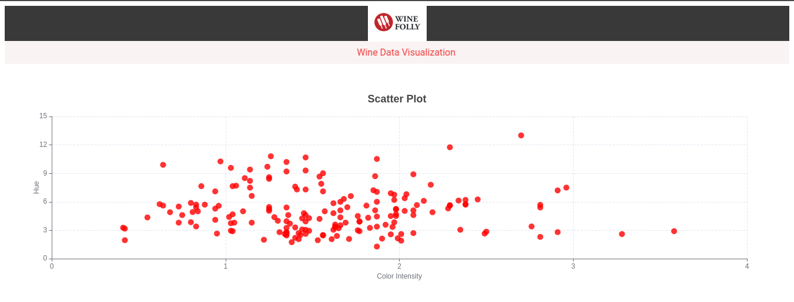
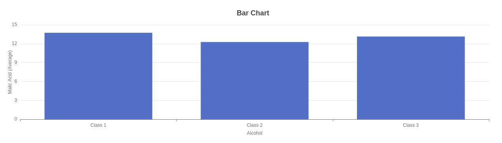

<h1 align="center">Charts By ECHARTS</h1>

<h3 align="center">This is a chart application built using the React JS, featuring two charts for the Wine data using ECharts.</h3>

<br />

<h2 align="center">🖥️ Tech Stack & Libraries</h2>


<p align="center">

  
  
  
   
   
   
</p>


<h4 align="center">Deployed On:</h4>

<p align="center">
  
</p>


<h3 align="center"><a target="_blank" href="https://manufac-assignment-eight.vercel.app/"><strong>Want to see live preview »</strong></a></h3>

<p align="center">
  <br />&#10023;
  <a href="#">View Demo</a> &#10023;
  <a href="https://github.com/Saurabhsanjay/manufac_assignment/issues">Report Bug</a> &#10023;
  <a href="#Getting-Started">Getting Started</a> &#10023; 
  <a href="#Install">Installing</a> &#10023;
  <a href="#Contact">Author</a> &#10023;
</p>


ECharts is a powerful data-visualization library that can be used to create a variety of charts and graphs. In my React project, I have utilized ECharts to create two charts for the Wine data. These charts are a scatter chart and a bar chart, both of which allow users to easily see and understand the data.
Both charts are highly customizable and user-friendly, allowing users to interact with the data and gain valuable insights. However, it is important to note that this project is solely for educational purposes and the Wine data should not be used for commercial purposes without proper authorization.


<br />

## Screens ( All screens are responsive)
- Homepage / Landing Page


<br />


## 🚀 Features
- User can see the details of Wine Data Visualization


<br />

## Glimpses of Echarts 🙈 :
 <table>
   <tr>
    <td></td>
    
  </tr>
   <tr>
    <td></td>
    
  </tr>
</table>


<br />


## Getting Started

This project was built using  React, HTML, CSS, TypeScript and ECHARTS for REACT . It is an Chart Data-Visualization web application and for running on your local environment you should follow these guidelines.


### Prerequisites

- YARN
- REACT-JS
- TYPESCRIPT


### Setup


The project repository can be found in [GitHub link](https://github.com/Saurabhsanjay/manufac_assignment) or just clone the project using this command.


```
Using HTTPS

# git clone https://github.com/Saurabhsanjay/manufac_assignment
```


## Install

Install YARN

Check that you have node and yarn installed

To check if you have Node.js installed, run this command in your terminal:


```
node -v
```

To confirm that you have yarn installed you can run this command in your terminal:


```
yarn -v
```


To install all the dependences of the project, run the following command:


```

npm install


To run the application got to the manufac-assignment folder and run the following command:

yarn start
```


### Tools used on this project

- Visual Studio Code
- CRA template


<br />


## Contact

© 2022 Saurabh Ubale
<p align="left">
    <a href="https://linkedin.com/in/saurabh-ubale-035a18234/">
        
    </a>
    <a title="saurabhubale371@gmail.com" href="mailto:saurabhubale371@gmail.com>
        
    </a>
    <a href="https://saurabhsanjay.github.io/saurabh-ubale/">
        
    </a>
    
</p>


## Show your support

Give a ⭐️ if you like this project!


